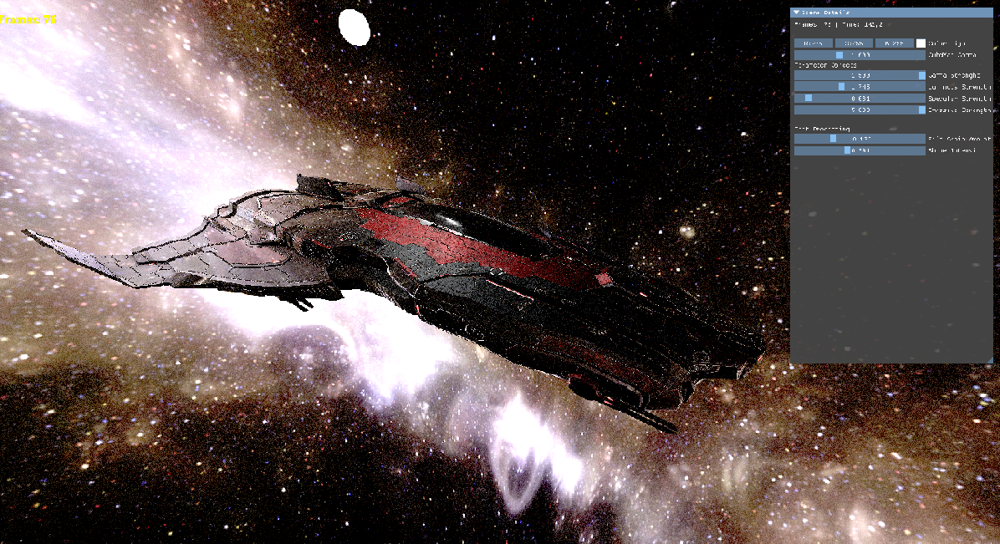

# OpenTK_Project

## An Opentk project with a lot already implemented

This project is already done and can serve as an example to build your own project.
What has already been done:
Asssimp is already implemented to load models, fonts can be loaded, a rendering framebuffer to create post-processing,
ImGui ready to use, PBR (Physically Based Renderin) techniques and environment reflection system, applied in the example model, A very conventional way to create CubeMaps
through rectangular images, some example shaders that can be very useful and some more meshes to create rectangles, spheres and cubes.

I hope this project is very useful for anyone to be able to deal with opentk, in the future I will implement new elements.

Video Example: (https://www.youtube.com/watch?v=44AdD1EnTbU)

### install

This project was made using dotnet core, to use it just install dotnet core and download it in the main directory inside some cmd
and call the dotnet build command.
