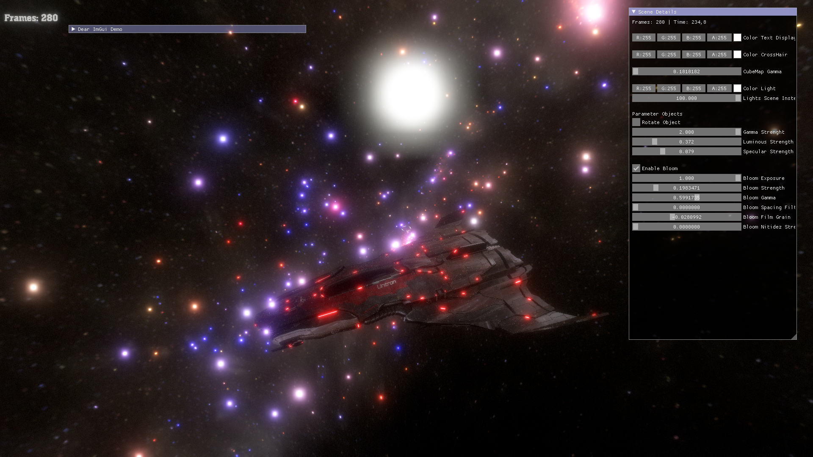

# OpenTK_Project

## Opentk Project ASSSIMP | FREETYPE | IMGUI | BULLET PHYSICS | BLOOM | CUBEMAPS | PBR 
__________

This project can be a good guide to help you implement some features
what has already been done:

* Asssimp.
* Freetype for fonts.
* ImGui.
* Engine Bullet Physics.
* Shader PBR;
* Load various types of skyboxes.
* Bloom Effect.

I hope this project is very useful for anyone to be able to deal with opentk, in the future I will implement new elements.

This video was posted without bloom...
Video Example: (https://www.youtube.com/watch?v=DZ6q1_Dccxs) 

********
### install

This project was made using dotnet core. 
* To use it just install dotnet core. 
* Download the repository or do a "git merge".
* In the main directory call the "dotnet build" command.
